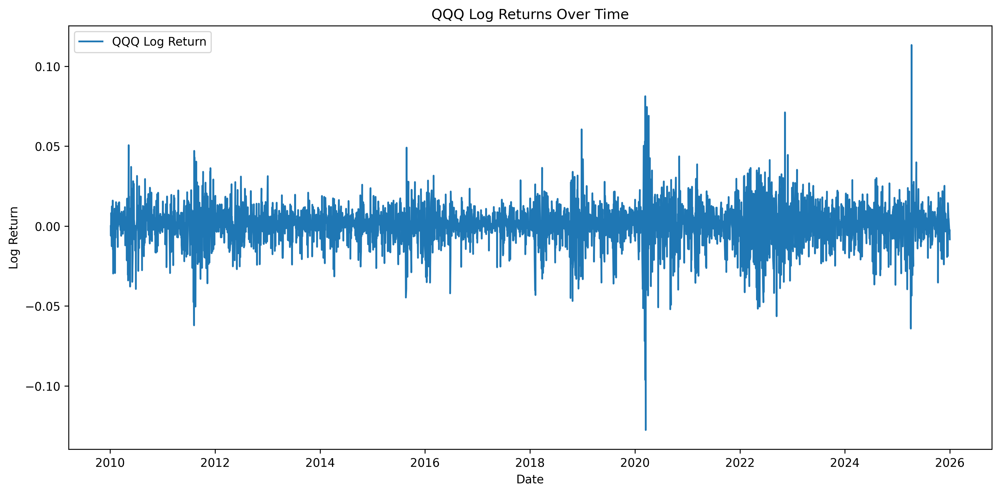
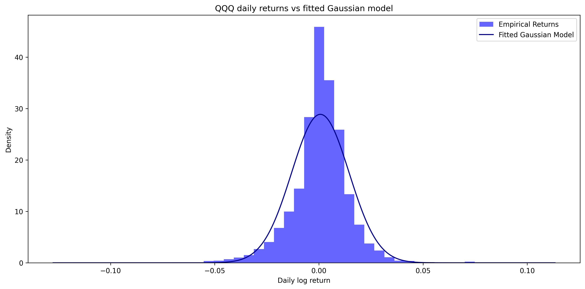
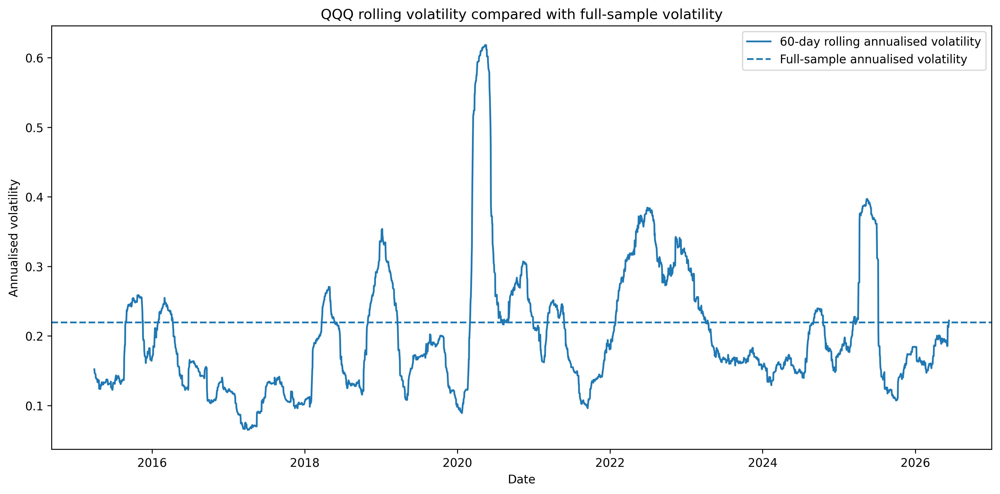
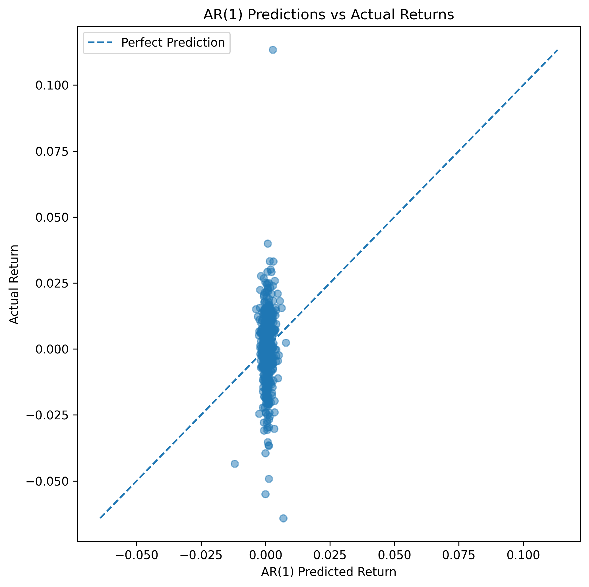

# Bayesian Time Series Finance

Goal: Build and evaluate Bayesian/statistical time-series models for financial data, with a focus on uncertainty, heavy-tailed returns, volatility clustering, and relevance to quant research.

## Project overview

This project investigates daily QQQ returns using statistical and Bayesian time-series methods. The initial aim is to understand how much structure exists in daily financial returns and whether simple models can produce useful out-of-sample predictions.

The project begins with exploratory analysis of QQQ price and return data, then compares simple forecasting baselines such as the mean-return model and the AR(1) model. The early results suggest that daily return predictability is weak, but the data shows features such as heavy tails and volatility clustering. This motivates moving beyond simple Gaussian return models towards Student-t likelihoods and volatility models.

## Current progress

Completed so far:

-Downloaded and cleaned QQQ daily price data
-Computed simple returns and log returns
-Analysed the empirical return distribution
-Compared returns with a fitted Gaussian model
-Investigated rolling volatlity and volatility clustering
-Built a mean-return baseline model
-Built and evaluated an AR(1) model using an 80/20 train-test split

## Key findings so far

The AR(1) model tests whether yesterday's QQQ return has linear predictive power for today's return. The fitted coefficient is small, and predictions remain close to the average return. This suggests that yesterday's return explains little of the variation in today's return.

However, this does not mean the time series has no useful structure. The return distribution shows evidence of heavy-tails, and rolling volatility suggests periods of clustered market turbulence. This motivates modelling uncertainty and volatility rather than focusing only on point forecasts of daily returns.

## Repository structure

```text
notebooks/
    01_exploratory_data_analysis.ipynb
    02_baseline_return_model.ipynb
    03_ar1_model.ipynb

figures/
    Saved plots used in the project write-up

data/
    Data files, if stored locally
```

## Key figures

### QQQ log returns



### QQQ returns vs Gaussian fitted model



### QQQ rolling volatility



### AR(1) predictions vs actual returns




